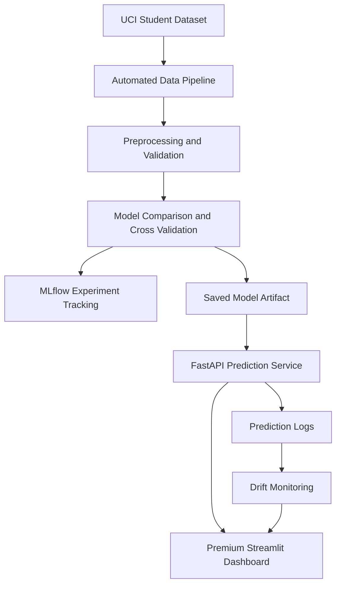

# Architecture

```mermaid
flowchart TD
    A[UCI Student Dataset] --> B[Automated Data Pipeline]
    B --> C[Preprocessing and Validation]
    C --> D[Model Comparison and Cross Validation]
    D --> E[MLflow Experiment Tracking]
    D --> F[Saved Model Artifact]
    F --> G[FastAPI Prediction Service]
    G --> H[Prediction Logs]
    H --> I[Drift Monitoring]
    G --> J[Premium Streamlit Dashboard]
    I --> J
```
